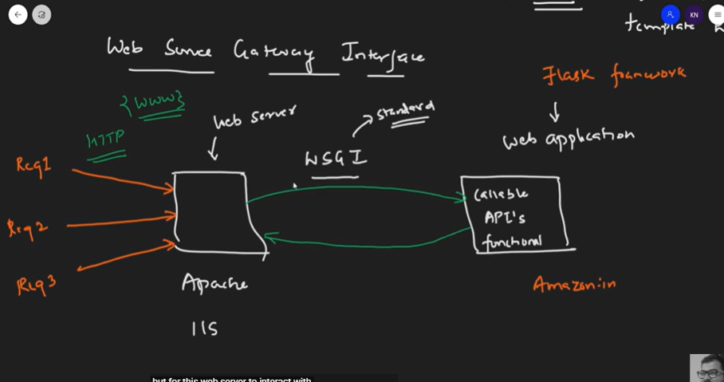

# Flask

## LEC 1

Flask is a web application framework written in Python. It is developed by Armin Ronacher, who leads an international group of Python enthusiasts named Pocco. Flask is based on the Werkzeug WSGI(Web server Gateway Interface (Standard/Protocol)) toolkit and Jinja2 template engine. Both are Pocco projects.

Ex web servers - Apache, IIS

Communication between web server and web application

Jinja 2: Web Templating system 
Combines a web template with a certain data source, for example ML model is a data source (renders dynamic pages)

STEPS TO RUN:
1.  python -m venv myenv
2. .\myenv\Scripts\Activate.ps1
3. pip install flask
4. python.exe -m pip install --upgrade pip
5. pip install -r requirements.txt
6. python app.py
